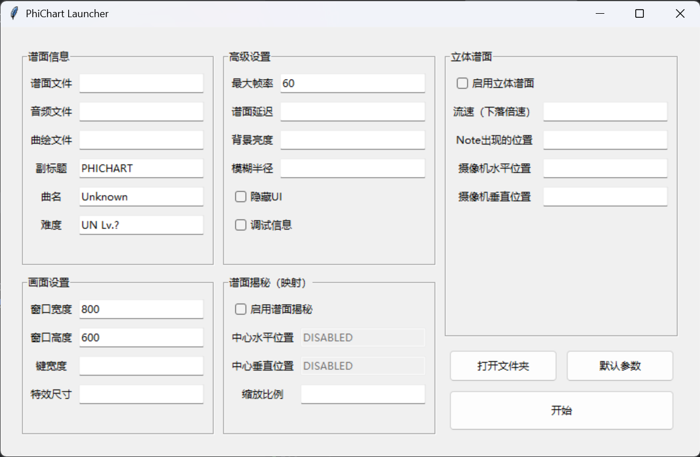
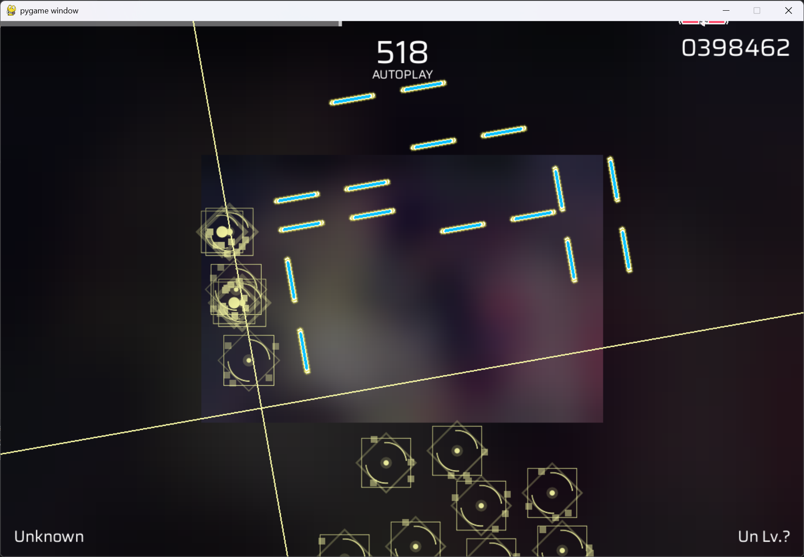

# PhiChart
A Phigros emulator based on python pygame.
一个基于Pygame的Phigros模拟器。

Player提供了丰富的自定义参数，允许用户实现各种奇特的功能，诸如谱面解密、竖屏模式等。

# 依赖
 - pygame
 - numpy

# 运行
### 方法一
转到右侧`Release`下载启动器，通过启动器启动。或下载整个项目，运行`launcher.py`。


### 方法二
1. 安装所需的依赖库。
2. 打开并运行`demo.py`即可。


# 自定义参数
Player提供了丰富的自定义参数，允许用户实现各种奇特的功能。
想要自定义参数，请使用上述**方法二**。
### 1. 默认参数
打开`demo.py`
```python
from player import Player
from autoMatch import Matcher


player = Player(Matcher("charts/rr/"))
player.initPlayer()
player.mainloop()
```
向Matcher传入所在的谱面文件夹即可打开。
在进入主循环前，应当先执行`Player.initPlayer()`函数。

### 2. 自定义分辨率
```python
player = Player(Matcher("charts/rr/"), w=1200, h=600)
```
通过在参数中加入**长度**和**宽度**来设置分辨率。将长度和宽度交换即可实现**竖屏显示**。

 - 过大的渲染面积可能导致性能受限。
 - 某些过于奇特的显示比例可能导致note的大小显得有些奇怪。可以通过以下代码来设置note的大小。在横屏模式下，note的大小为窗口宽度的1/8时最合适，在竖屏模式下，note的大小为窗口宽度的1/4时最合适。
```python
(import...)

player = Player(Matcher("charts/rr/"), w=600, h=1200)
player.noteSize = 150
player.initPlayer()
player.mainloop()
```
 - 同理可以设置特效的大小。
```python
(import...)

player = Player(Matcher("charts/rr/"), w=600, h=1200)
player.hitEffectSize = 200
player.initPlayer()
player.mainloop()
```
### 2. 自定义帧率
```python
player = Player(Matcher("charts/rr/"), fps=120)
```
 - 击中note特效是固定的42帧。帧数越高，特效越快消失。
 - 推荐帧数范围是60~120帧
### 3. 自定义标题
```python
player = Player(Matcher("charts/rr/"), subtitle="奥托普雷先生", level="SP Lv.18", chartName="歌曲名字")
```
歌名、难度、连击数下的那行字都是可以修改的。
### 4. 自定义谱面延迟
```python
player = Player(Matcher("charts/rr/"), chartDelay=0.5)
```
 - 单位是秒。
### 5. 调试模式
```python
player = Player(Matcher("charts/rr/"), debug=True)
```
输出一些debug所需的信息。开启后可能会稍微消耗一些性能。
### 6. 隐藏UI
```python
player = Player(Matcher("charts/rr/"), displayUI=False)
```
不再显示任何文字内容。
### 7. 谱面揭秘功能（映射）
```python
player = Player(Matcher("charts/rr/"), enableMapping=True)
```
开启后会缩放画面，使得平时处于画面外的内容能够被看到，从而制作出类似“谱面揭秘”的功能。
```python
from player import Player
from autoMatch import Matcher


player = Player(Matcher("charts/rr/"), w=1200, h=800)
# player.targetRectOfMapping = (300, 200, 900, 600)  # 此参数暂时受限，不允许自定义
player.initPlayer()
player.mainloop()
```
通过指定`player.targetRectOfMapping`来设置缩放后的位置。这段代码的意思是将原本整个画面缩放到`(300, 200)`到`(900,600)`围成的矩形范围内。
运行效果如图：

### 8. 背景亮度和模糊半径
```python
player = Player(Matcher("charts/rr/"), brightness=0.8, blurRadius=20)
```
设置背景图的亮度和模糊程度。
 - 亮度为0（最暗）~1（最亮）
 - 使用的是先压缩，再高斯模糊。

### 8.立体谱面
以下是示例代码和相关参数的设置。启动器暂未同步此功能。
```python
from player import Player
from autoMatch import Matcher


player = Player(Matcher("charts/白复生 IN"), w=1920, h=1080, fps=90)

# 设置副标题
player.name = "PRAGMATISM -RESURRECTION-"
player.level = "IN Lv.16"

# 启用3D
player.enable3D = True

# 设置摄像机位置，推荐处于中间偏上的位置
player.cmrY = player.height*0.72
player.cmrX = player.width*0.5

# 设置键出现的位置，推荐值为3倍屏幕高度
player.boundary = 3.0 * player.height
# 设置流速，推荐为3倍速
player.speed = 3.0

# 设置键大小和特效大小，由于透视，建议调大一点
player.noteSize = player.width / 7
player.hitEffectSize = player.width / 6

# 初始化并进入消息循环
player.initPlayer()
player.mainloop()
```


