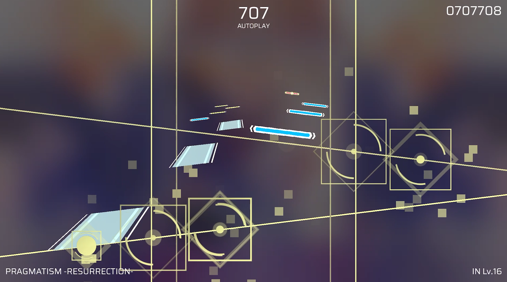

# PhiChart
A Phigros emulator based on python pygame.
一个基于Pygame的Phigros模拟器。

Player提供了丰富的自定义参数，允许用户实现各种奇特的功能，诸如谱面解密、竖屏模式等。


# RPE谱面兼容性说明
当前版本的 PhiChart Player 与 PhiChart Editor 实现了对RPE谱面格式的部分兼容。
请注意，PhiChart Editor 暂不支持打开 RPE Json 文件，但可以在其创建的项目中使用部分的 RPE 功能。

| RPE新增功能    | PhiChart Player 兼容情况 | PhiChart Editor 兼容情况 | 字段名称                |                                                                        |
|------------|----------------------|----------------------|---------------------|------------------------------------------------------------------------|
| 动态BPM      | 不支持                  | 不支持                  | `BPMList`           | 对于官谱格式，将使用0号线的bpm作为全局BPM；RPE的判定线无独立的BPM                                |
| Json自带的元数据 | 支持                   | 支持                   | `META`              | 在播放时，元数据不会覆盖手动指定的曲名、难度等信息；编辑器导出的Json中，RPEVersion被标记为160；此值对播放器不产生任何影响。 |
| 判定线组       | 不读取                  | 不支持                  | `judgeLineGroup`    |                                                                        |
| 判定线名称      | 不读取                  | 不支持                  | `Name`              |                                                                        |
| 判定线贴图      | 不读取                  | 不支持                  | `Texture`           |                                                                        |
| 事件层        | 支持                   | 不支持                  | `eventLayers`       | 正在适配中                                                                  |
| 父线         | 不支持                  | 不支持                  | `father`            |                                                                        |
| 遮罩         | 不支持                  | 不支持                  | `cover`             |                                                                        |
| 图层         | 不支持                  | 不支持                  | `zOrder`            | 线的渲染顺序由当时的透明度决定                                                        |
| 绑定UI       | 线将被隐藏                | 不支持                  | `attachUI`          |                                                                        |
| GIF贴图      | 未知                   | 未知                   | `isGIF`             | 取决于Pygame                                                              |
| 控制Controls | 不支持                  | 不支持                  | ---                 | 正在适配中                                                                  |
| BPM因子      | 不支持                  | 不支持                  | `bpmfactor`         | 正在适配中                                                                  |
| 反向下落       | 支持                   | 支持                   | `above`             |                                                                        |
| 透明度        | 支持                   | 支持                   | `alpha`             | 即将推出的新播放器不支持（Player3D.py)                                              |
| 假键         | 支持                   | 支持                   | `isFake`            | 即将推出的新播放器不支持（Player3D.py)                                              |
| 可见时长       | 支持                   | 支持                   | `visibleTime`       | 即将推出的新播放器不支持（Player3D.py)                                              |
| Note的y轴偏移  | 不支持                  | 不支持                  | `yOffset`           |                                                                        |
| 自定义下落音效    | 不支持                  | 不支持                  | `hitsound`          |                                                                        |
| Note自定义颜色  | 不支持                  | 不支持                  | `color`             |                                                                        |
| 贝塞尔缓动      | 不支持                  | 不支持                  | `bezier`            | 正在适配中                                                                  |
| 缓动         | 支持                   | 支持                   | `easingType`        |                                                                        |
| 颜色事件       | 支持                   | 只读                   | `colorEvents`       |                                                                        |
| X缩放事件      | 支持                   | 只读                   | `scaleXEvents`      |                                                                        |
| Y缩放事件      | 支持                   | 只读                   | `scaleXEvents`      |                                                                        |
| 文本事件       | 不支持                  | 不支持                  | `textEvents`        |                                                                        |
| ~~绘图事件~~   | 不支持                  | 不支持                  | ~~`paintEvents`~~   | 此项目已被RPE废弃                                                             |
| ~~倾斜事件~~   | 不支持                  | 不支持                  | ~~`inclineEvents`~~ | 此项目已被RPE废弃，但PhiChart使用theta事件替代了此功能                                    |


# 编写自定义的启动脚本
 - Player类提供了丰富的自定义参数，允许用户实现各种奇特的功能。
 - Player3D类在Player类的基础上实现了更多功能。

## Player类接口与功能清单
### 成员变量表
此表列出了所有public成员，不在此表列中的接口应被视为priveta。

| 成员                        | 描述                                                         | 在Player类中的描述                       | 在Player3D类中的描述                                          | 默认值        | 数据类型                     |
|---------------------------|------------------------------------------------------------|------------------------------------|---------------------------------------------------------|------------|--------------------------|
| `width`                   | 窗口宽度，像素                                                    |                                    |                                                         | 1200       | `int`                    |
| `height`                  | 窗口高度，像素                                                    |                                    | 默认值为800                                                 | 600        | `int`                    |
| `lineLength`              | 判定线长度                                                      |                                    |                                                         | 3.6*屏幕高度   | `float`                  |
| `lineWidth`               | 判定线宽度                                                      |                                    |                                                         | 0.006*屏幕高度 | `float`                  |
| `noteSize`                | 键的宽度                                                       |                                    |                                                         | 屏幕宽度/8     | `float`                  |
| `hitEffectSize`           | 打击特效的宽度和高度                                                 |                                    |                                                         | 屏幕宽度/6     | `float`                  |
| `subtitle`                | 连击数下方的字                                                    |                                    |                                                         | "AUTOPLAY" | `str`                    |
| `level`                   | 右下角的字                                                      |                                    |                                                         | "Un Lv.?"  | `str`                    |
| `name`                    | 左下角的字                                                      |                                    |                                                         | "Unknown"  | `str`                    |
| `displayDebug`            | 是否显示调试信息，可能影响性能                                            |                                    |                                                         | false      | `bool`                   |
| `displayUI`               | 是否显示UI。当此值为false时，`displayDebug`值失效                        |                                    |                                                         | true       | `bool`                   |
| `doubleHitEffect`         | 是否高亮显示双押                                                   |                                    |                                                         | true       | `bool`                   |
| `FPS`                     | 最大帧率，并非固定帧率                                                |                                    | 默认值为120                                                 | 60         | `int`                    |
| `speed`                   | 谱面播放倍速，不影响音乐                                               |                                    |                                                         | 1.0        | `float`                  |
| `startTimeS`              | 开始播放的位置，必须为整数，秒                                            |                                    |                                                         | 0.0        | `int`                    |
| `chartDelay`              | 谱面延迟，秒                                                     |                                    |                                                         | 0.0        | `float`                  |
| `enableMapping`           | 启用谱面揭秘                                                     |                                    |                                                         | False      | `bool`                   |
| ~~`targetRectOfMapping`~~ | 启用谱面揭秘后，将原画面缩放到的区域                                         |                                    |                                                         | 已被禁用       | `tuple[float]`           |
| `enable3D`                | 启用立体事件；此值为False时，与本家无异                                     | 默认值为False；当此值为True时，所有键的下落方向改为z轴向外 | 默认值为True；当此值为True时，启用PhiChart新增的theta、moveZ、angle三个立体事件 |            | `bool`                   |
| `speed3D`                 | 流速倍率                                                       | 仅在`enable3D`为True时生效               | 一直生效                                                    | 1.0        | `float`                  |
| `boundary`                | z轴渲染的最远距离。启用3D后，此值为键出现的位置                                  |                                    |                                                         | 3*屏幕高度     | `float`                  |
| `cmrPos`                  | 摄像机位置，向量                                                   | 无此值                                |                                                         | 屏幕中央       | `libs.vec3D.V3d`         |
| `FOV`                     | 视角大小，弧度制                                                   | 无此值                                |                                                         | 待补充        | `float`                  |
| `FL`                      | 摄像机最近成像距离                                                  | 无此值                                |                                                         | 待补充        | `float`                  |
| `enableCompiler`          | 启用转谱；此值为True时，将会生成一个可以导入模拟器中游玩的zip包                        |                                    | 暂不支持                                                    | False      | `bool`                   |
| `matcher`                 | Matcher对象，用于自动匹配指定文件路径下的Json、曲绘和音频文件                       |                                    |                                                         | None       | `libs.autoMatch.Matcher` |
| `illuFile`                | 手动指定曲绘文件。matcher不为None时，无需再设置此值                            |                                    |                                                         | None       | `str`                    |
| `chartFile`               | 手动指定Json文件。matcher不为None时，无需再设置此值                          |                                    |                                                         | None       | `str`                    |
| `audioFile`               | 手动指定音频文件。matcher不为None时，无需再设置此值                            |                                    |                                                         | None       | `str`                    |
| ~~`chart`~~               | 手动指定Chart对象。Chart对象应由analyzer产生或手动创建空白对象。此接口已废弃，可能引发未知的Bug |                                    |                                                         | None       | `libs.chart.Chart`       |
| `enableNewVision`         | 启用新视野；此值为True时，谱面被缩放到屏幕下方以实现ELEVATED效果                     |                                    |                                                         | False      | `bool`                   |

### 函数表
此表列出了所有public函数，不在此表列中的函数应被视为priveta。

| 函数/方法                                | 描述                                          | 在Player类中的描述 | 在Player3D类中的描述 |
|--------------------------------------|---------------------------------------------|--------------|----------------|
| `setCmrDir(dir: V3d, x_angle_inc=0)` | 设置摄像机朝向，仅在启用3D时生效                           | 无此接口         |                |
| `initPlayer()`                       | 初始化播放器；内含加载谱面、初始化Pygame、预渲染Note贴图，必须在主循环前调用 |              |
| `mainloop()`                         | 主循环；播放谱面并阻塞线程                               |              |
| `outputChart()`                      | 导出一个可导入模拟器的zip包；即将被废弃此接口，不建议调用              |              |


## 启动脚本示例

以下是启用立体效果的脚本示例代码。

```python
from player import Player
from libs.autoMatch import Matcher

# 传入谱面文件所在目录，autoMatch将匹配目录下的Json、曲绘和音频文件
player = Player(Matcher("charts/白复生 IN"), w=1920, h=1080, fps=90)

# 设置副标题
player.name = "PRAGMATISM -RESURRECTION-"
player.level = "IN Lv.16"

# 启用3D
player.enable3D = True

# 设置摄像机位置，推荐处于中间偏上的位置
player.cmrY = player.height * 0.72
player.cmrX = player.width * 0.5

# 设置键出现的位置，推荐值为3倍屏幕高度
player.boundary = 3.0 * player.height
# 设置流速，推荐为3倍速
player.speed3D = 3.0

# 设置键大小和特效大小，由于透视，建议调大一点
player.noteSize = player.width / 7
player.hitEffectSize = player.width / 6

# 初始化并进入消息循环
player.initPlayer()
player.mainloop()
```



# 文件结构

 - demo.py
```
演示脚本。直接运行即可打开 PhiChart Player 播放器。
内容常常更新，一般是Player的新功能演示。
```

 - editor Launcher.py
```
编辑器的启动器，直接运行即可打开或创建谱面并启动 PhiChart Editor 进行编辑。
```

 - launcher.py
```
播放器的启动器，直接运行即可打开谱面并启动 PhiChart Player 进行播放。
```
 - player.py
```
播放器的核心代码。内含 Player 类的实现。
```
 - Player3D.py
```
新的3D播放器核心代码。内含 Player3D 类的实现。
此播放器支持了自由摄像机、Z轴位移（MoveZ）、下落面倾斜（theta）等新功能。
尚未投入使用，可通过启动脚本手动调用。
```
 - libs/
```
此目录下存储了 PhiChart Player 的所依赖的多个类、工具库等。
```
 - tk/
```
此目录下存储了 PhiChart Editor 的核心代码。
包含多个类、工具库和编辑器UI等
```
 - tk/projects/
```
此目录下存储了 PhiChart Editor 创建的项目文件。
```
 - assets/
```
此目录下存储了 Player 所需的所有资源文件。
似乎有很多意义不明的垃圾文件可能早已被废弃，但没有删除，算了管他吧。
```
 - bin/
```
只是存放了一个 ffmpeg.exe 用于在x86环境下处理音频。
```
 - script/
```
存储了几个可供运行的启动脚本。
```
 - chart/
```
存储了大量供调试用的谱面文件、曲绘、音频等等。
主要来自拆包。
```

# 关于此分支
 - 添加了对RPE自制谱的部分支持。
 - 此分支包含一个 3D 制谱器。
 - 此分支包含两个 3D 播放器。

# 致谢/借物表
谨在此对所有为 PhiChart 提供设计灵感与帮助的个人和组织表示感谢！

Phigros @Phigros官方  
https://space.bilibili.com/414149787

ffmpeg.exe   
https://github.com/FFmpeg/FFmpeg

Re:PhiEdit @cmdysj  
https://space.bilibili.com/252635690

KipPhiApparatus @Zes-MinKey-Young  
https://github.com/Zes-MinKey-Young/KipPhiApparatus

